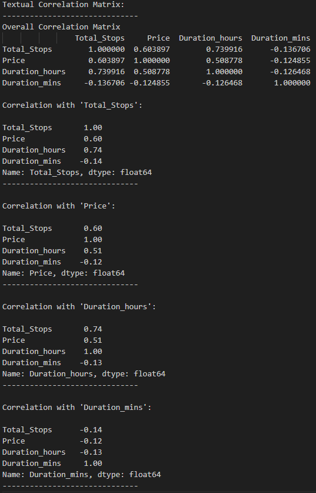
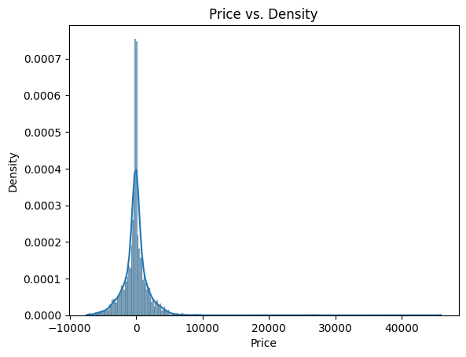
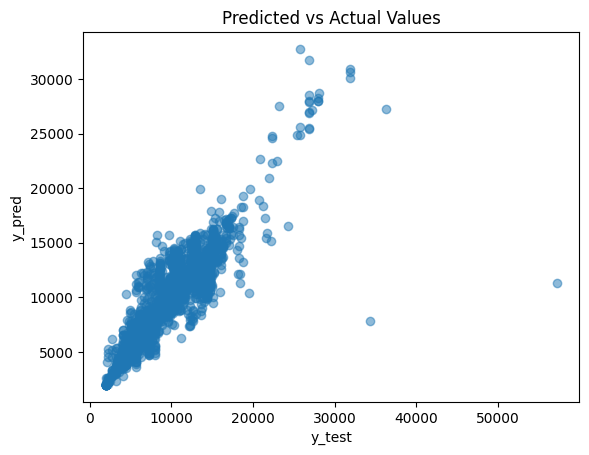
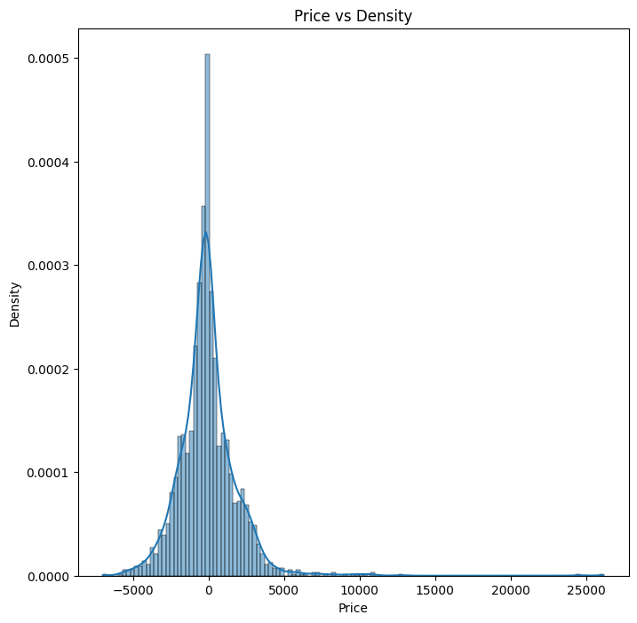
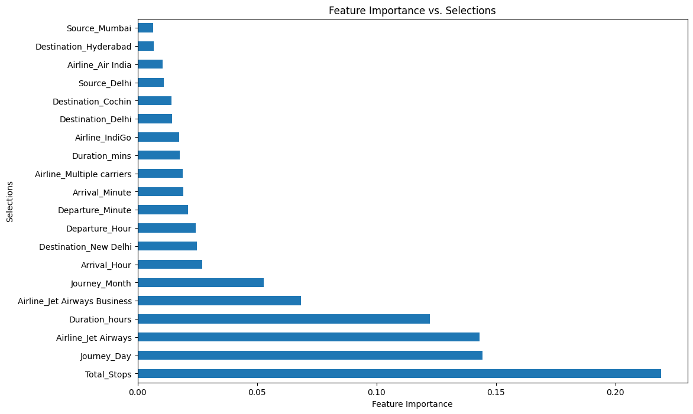
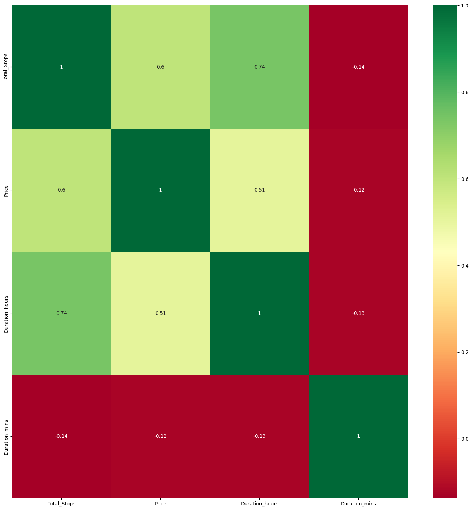
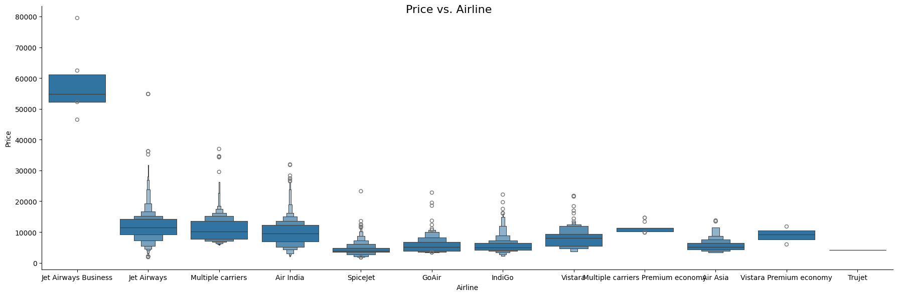
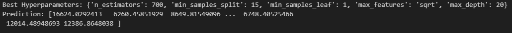
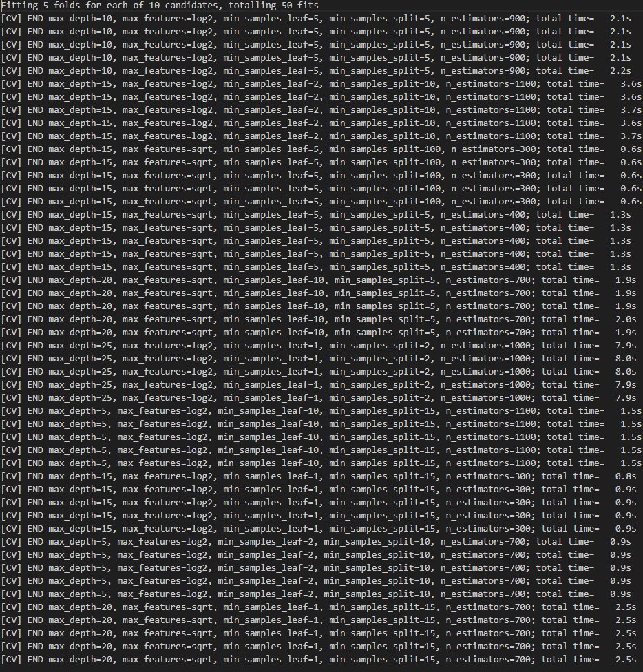

# Project Outline:
This code covers various aspects of a machine learning pipeline, including data preprocessing, exploratory data analysis (EDA), feature engineering, model training, evaluation, and hyperparameter tuning. It also includes visualizations to help understand the data and model performance. This was done for my Introduction to Machine Learning: Supervised Learning class. The overall goal of this project is to develop a predictive model to estimate airfare prices. This will allows travelers to make more informated decisions on where and when to buy certain airfare tickets. It will also allow airlines to optimize their pricing strategies. This information will be super helpful for anyone trying to understand airfare prediction and travel analytics.

# Task
Since the goal of this project is to predict a continuous numerical value, the flight price, the overal task here is a regression task.

# Dataset:
<ins>Summary</ins>\
Flight Price Prediction Dataset is a comprehensive collection of data aimed at predicting the prices of airline tickets. This dataset provides a rich source of information for machine learning and data analysis enthusiasts interested in the aviation and travel industry. It includes a wide range of features and variables, such as flight routes, departure and arrival cities, airline carriers, departure and arrival times, ticket class, and more. With this dataset, researchers and data scientists can explore and develop predictive models to estimate airfare prices, helping travelers make informed decisions and airlines optimize their pricing strategies. It's a valuable resource for anyone looking to delve into the world of airfare prediction and travel analytics. This dataset was found on kaggle and the project description was used from the site.


<ins>Data Type</ins>\
Tabular data inside of an excel spreadsheet. 6 numerical and 5 categorical data.

<ins>Train Set Information</ins>\
Total Rows: 10683\
Total Columns: 11

<ins>Test Set Information</ins>\
Total Rows: 2671\
Total Columns: 10

<ins>Citations</ins>\
Author: Amar Mandal\
Kaggle Link: https://www.kaggle.com/datasets/muhammadbinimran/flight-price-prediction/data


# Data Cleaning:
<ins>Why I Needed To Clean The Data?</ins>\
There were several spots inside the dataset that needed to be cleaned. Firstly this was needed to ensure data accuracy. By detecting and correct these errors in the dataset, it helped to ensure that the data could correctly identify a real world situation. Next, I needed to handle any sort of missing values. There were a lot of fields inside of the additional info that really had no info that was provided. I also needed to remove any N/As from the dataset. I also wanted to focus on the unique rows and filter out any sort of duplicated data that arose from the excel data. Lastly, I had to clean several of the fields like 'Arrival Time' in order to split them into columns that are just numbers. This allowed me to use the data more efficiently.

<ins>How I Cleaned The Data</ins>\
First,  I had to drop certain columns because they didn't provide accurate information due to what was missing. I ran the command 'trainDataSet.drop(["Route", "Additional_Info"], axis = 1, inplace = True)' in order to remove these columns that had little useful information. Second, to verify that there was no missing values, I ran the command '.dropna(inplace = True)' in order to remove any missing values from the dataset. I then ran a summary count to verify all of the nulls were removed using '.isnull().sum()'. Next, in order to only look at the unique values to get the useful information I ran the command '.value_counts()'. I was able to filter on these to help decide on certain subsets of features. Lastly, in columns like 'Arrival Time', I filtered the time from '01:10 22 Mar' to just grabbing the hour and minutes. I made seperate columns by parsing the '01' and that '10' out of the time and ignoring the day and month.

```
# Little useful data is included in the additional info section. Routes and Total Stops appear to be related so we can drop them.
testDataSet.drop(["Route", "Additional_Info"], axis = 1, inplace = True)
```

<ins>Conclusion</ins>\
Although there was a lot of cleaning that had to be done, I think it was very helpful in order to use that data for what I needed. The dropping of the N/As and filtering on uniques really was not that hard to do here for this project. I struggled a bit when it came to cleaning some of the dates out into my needed format. It was challenging to parse out the certain information that I needed into my columns. Overall I think dropping the unneeded data, and checking for the missing values helped minimize the risk of error as I continued on throughout my project.

<ins>Visualizations</ins>\
Data Cleaning and data set visualizations can be found throughout the project and I encourage you to take a look in the notebook or at the sample snippet below. You can look for the code snippets I mentioned in the 'How I cleaned data' section for key areas where the data cleaning occured.

```
# Drop rows with missing values in the test dataset
testDataSet.dropna(inplace = True)
print(testDataSet.isnull().sum())
```


# Exploratory Data Analysis (EDA):
<ins>Analysis / Conclusion</ins>\
Throughout the exploratory data analysis section, I was able to understand several core aspects of this project. Looking at the below correlation matrix, you can tell the association between the total stops, price, duration hours and duration minutes. There is a strong positive correlation (0.6) between the number of stops and the price of the flight. This would likely suggest that as the number of stops increase, then the price tends to increase. Next, there is an even strong correlation between the total number of stops and the duration hours of the flight which makes sense. The correlation here is 0.74 which implies that flights with more stops typically have longer flight times. The duration minutes has a negative correlation with both Price and total stops at (-0.14 and -.12) which means as the number of stops or as the price increases, the duration of minutes of the flight typically goes down. Lastly, there is a moderate positive correlation between price and duration hour at 0.51. This may indicate that longer flights have higher associated prices.

<ins>Visualizations</ins>\
Correlation Matrix:\


Before Tuning:\



Post Tuning:\



# Model:
<ins>Multilinear Regression / Collinearity</ins>\
I used a Random Forest Regressor in the project which is an ensemble method that is based on decision trees. It is a non-linear model that is different from your typical linear regresision. The Random Forest Regressor is able to handle compelx relationships between features.

<ins>Feature Engineering</ins>\
I applied a lot of feature engineering concepts throughout this project. Feature Engineering is the process of creating new features from exisiting ones. For example, in the 'Arrival_Time', I was able to make two new features called 'Arrival_Hour' and 'Arrival_Minute'. This same thing applied for a few other features. The categorical features like airline, source and destination were then one hot encoded to make them sutable for the machine learning models.
```
# Create 'Arrival_Hour' and 'Arrival_Minute' columns
trainDataSet["Arrival_Hour"] = pd.to_datetime(trainDataSet.Arrival_Time).dt.hour
trainDataSet["Arrival_Minute"] = pd.to_datetime(trainDataSet.Arrival_Time).dt.minute
```

<ins>Multiple ML Models</ins>\
This project makes use of two ML models, the Random Forest Regressor and the Extra Trees Regressor. Both of these models are ensemble tree-based methods and using more than one model here allowed me to ensure accurate and stable predictions in my models.

```
# Splits the data into training and testing sets using a RandomForestRegressor
X_train, X_test, y_train, y_test = train_test_split(X, y, test_size = 0.2, random_state = 42)
regressorRandomForest = RandomForestRegressor()
regressorRandomForest.fit(X_train, y_train)
```

```
# Selects a feature using the ExtraTreesRegressor
selection = ExtraTreesRegressor()
selection.fit(X, y)
print(f"Feature Importances: \n{selection.feature_importances_}")
```

<ins>Hyperparameter Tuning</ins>\
I was able to provide hyperparameter tuning through the use of the RandomizedSearchCV method. This optimized the RandomForestRegressor's performance. I used a various number of estimators, depths and minimum leaf samples to determine the best model configuration.
```
# Defines the overall search space
numberOfEstimators = [int(x) for x in np.linspace(start = 100, stop = 1000, num = 10)]

# Features being considered
featureTypes = ['sqrt', 'log2']

# Depth of the tree is set to the number of levels deep the tree is
maxDepth = [int(x) for x in np.linspace(5, 30, num = 6)]

# Samples needed to split nodes
sampleSplits = [2, 5, 10, 15, 100]

# Samples needed to reach leaf nodes
sampleLeafs = [1, 2, 5, 10]

# Generates a random grid we can use for our param distributions in RSCV
random_grid = {'n_estimators': numberOfEstimators,
               'max_features': featureTypes,
               'max_depth': maxDepth,
               'min_samples_split': sampleSplits,
               'min_samples_leaf': sampleLeafs}

# Generates a random forest regressor instance
randomForestRegressor = RandomizedSearchCV(estimator = regressorRandomForest, param_distributions = random_grid,scoring = 'neg_mean_squared_error', n_iter = 10, cv = 5, verbose = 2, random_state = 42, n_jobs = 1)

# Fits a model with the training data.
randomForestRegressor.fit(X_train,y_train)
```


# Results and Analysis:
<ins>Summary</ins>\
A lot can be seen as a result of this project. Firstly when it came to the feature selection and determination, I was able to look at the feature importance below based on my selection to determine what features were important to me in my testing. You can tell that the total number of stops, the day on which the flight is being traveled on, the airline and the duration in hours are all highly important features to keep an eye on. 


I could also use the below heat map to visualize the correlation between some of my features. You can see belows how Total Stops, Price, Duration Hours and Duration Minutes are correlated. As I mentioned in my EDA, there is a strong positive correlation (0.6) between the number of stops and the price of the flight. This would likely suggest that as the number of stops increase, then the price tends to increase. Next, there is an even strong correlation between the total number of stops and the duration hours of the flight which makes sense. The correlation here is 0.74 which implies that flights with more stops typically have longer flight times. The duration minutes has a negative correlation with both Price and total stops at (-0.14 and -.12) which means as the number of stops or as the price increases, the duration of minutes of the flight typically goes down. Lastly, there is a moderate positive correlation between price and duration hour at 0.51. This may indicate that longer flights have higher associated prices.


Below here you can see the average price based on the airlines in the dataset I grabbed from. This helps to see how the airlines compare in prices. And since Jet Airways fell into a high importance, it is easy to see how that compares to something like Air India, Go Air or IndiGo.


<ins>Evaluation Metrics</ins>\
The random forest regressor and the randomized search cv were used to generate some of the evaluation metrics. Below you can see a list of the best hyperparameters from using the RandomizedSearchCV. You can also see the output from the RandomizedSearchCV on how it fit to 5 folds on each of the 10 candidates for a total of 50 fits.




<ins>Model Performance</ins>\
Next, when evaluating the performance of the random forest regressor, you can look at the error rates before and after tuning using my selected hyperparameters. I evaluated the model using 5 evaluation metrics: Mean Absolute Error, Mean Squared Error, Root Mean Squared Error, Normalized Root Mean Squared Error and R-Squared Score.

Before Tuning:\


Post Tuning:\


# Conclusion:
<ins>What I Learned / Key Takeaway</ins>\
I learned that there are many correlations amongst the features in this dataset. I was able to clearly identify the strength and direction of different variables. Specifically I showed how total stops, price, duration hours and duration minutes were related. I identifed a strong positive correlation between the number of stops and the duration against the total price of a flgiht. This would then lead to suggest that flights that are longer or have more stops tend to cost more. I also learned about the potential temporal variations that this dataset can introduce. Since we do have the data around the entire year in different months, I am able to get a wider and more accurate representation of the flight price data throughout the year. Sometimes flight prices fluctuate around the holidays and this can be an important factor in data like this.

<ins>What Didn't Work</ins>\
The data doesn't really account for potential non-linear relationships, outliers or other complexities inside of the dataset. Also, identifying the cause is tricky when it comes to this too. Even though there is a positive correlation between the number of stops / duration against the price of the flight, it doesn;t necessarily mean that those are the cause of each other.

<ins>Ways To Improve</ins>\
There are many opportunities that I could build off of this project and make it even better than it already is. Firstly, I could explore some new non-linear relatiionships. This could allow me to capture more complex patterns. I could add additional checks to account for some of the outliers in the dataset to make sure that they are not affecting my model. I could experiment with other machine learning models and see how the compare verses the ones I used in this project.